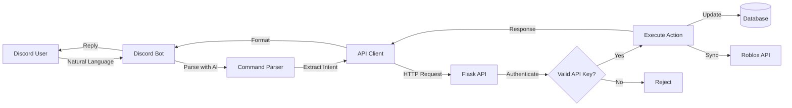

# Discord Bot Integration Guide

## 📋 Table of Contents

1. [Overview](#overview)
2. [Architecture](#architecture)
3. [What You Need From Your Bot](#what-you-need-from-your-bot)
4. [Project Structure Options](#project-structure-options)
5. [API Endpoints Reference](#api-endpoints-reference)
6. [Authentication Flow](#authentication-flow)
7. [Natural Language Command Examples](#natural-language-command-examples)
8. [Security Considerations](#security-considerations)
9. [Setup Guide](#setup-guide)
10. [Troubleshooting](#troubleshooting)

---

## Overview

This guide explains how to integrate your AI-powered Discord bot with the TF_System. The integration allows users to manage taskforce members, ranks, and activities using natural language commands in Discord.

**Example Commands:**
```
🤖 User: "Can you change João's rank to Commander?"
✅ Bot: "Updated João's rank from Paladin to Commander and synced to Roblox!"

🤖 User: "Show me all members with rank Crusader"
📋 Bot: "Found 5 Crusaders: Alice, Bob, Charlie, David, Emma"

🤖 User: "Add a new member called Mike with rank Novice"
✅ Bot: "Added Mike as Novice. Please provide Roblox username for sync."
```

---

## Architecture



### Data Flow Example

1. **User**: "Change Sarah's rank to Paladin"
2. **Discord Bot** receives message
3. **AI** parses intent: `{action: "change_rank", member: "Sarah", new_rank: "Paladin"}`
4. **API Client** calls: `PATCH /api/v1/members/search?name=Sarah` → Get member ID
5. **API Client** calls: `PATCH /api/v1/members/123/rank` with `{"rank": "Paladin"}`
6. **Flask API** validates, updates database, syncs to Roblox
7. **Response** sent back through chain
8. **Bot** replies to user with success message

---

## What You Need From Your Bot

To integrate with TF_System, your Discord bot needs:

### Required Components

1. **HTTP Client** (for API requests)
   - Python: `aiohttp` or `requests`
   - JavaScript: `axios` or `node-fetch`

2. **Command Parser**
   - Your existing AI integration
   - Intent extraction (what action to perform)
   - Entity extraction (member names, ranks, etc.)

3. **API Key Storage**
   - Store in `.env` file
   - Never hardcode in source code

### Bot Code Structure

```
your_discord_bot/
├── bot.py                          # Main bot file
├── cogs/
│   └── taskforce_commands.py      # TF management cog
├── utils/
│   ├── tf_api_client.py           # API client for TF_System
│   └── ai_parser.py               # AI command parsing
├── .env                           # Configuration (TOKEN, API_KEY)
└── requirements.txt               # Dependencies
```

---

## Project Structure Options

### Option A: Monorepo (Recommended) ⭐

**Keep bot code within TF_System repository:**

```
TF_System/
├── Taskforce_System/              # Flask app
│   ├── api/
│   │   └── discord_bot_api.py    # New API endpoints
│   ├── app.py
│   └── ...
├── discord_bot/                   # Your Discord bot
│   ├── bot.py
│   ├── cogs/
│   ├── utils/
│   └── .env
├── requirements.txt               # Flask requirements
└── discord_bot_requirements.txt   # Bot requirements
```

**Pros:**
- ✅ Everything in one place
- ✅ Easy to develop and test
- ✅ Single deployment location
- ✅ Shared documentation

**Cons:**
- ❌ Larger repository size
- ❌ Mixed concerns (web + bot)

---

### Option B: Separate Repositories

**Keep bot in its own repository:**

```
TF_System/                         # Repo 1
└── Taskforce_System/
    ├── api/
    │   └── discord_bot_api.py
    └── ...

discord-tf-bot/                    # Repo 2 (separate)
├── bot.py
├── utils/
│   └── tf_api_client.py
└── .env
```

**Pros:**
- ✅ Clean separation of concerns
- ✅ Independent versioning
- ✅ Can deploy separately

**Cons:**
- ❌ More complex to manage
- ❌ Need to coordinate deployments
- ❌ Duplicated documentation

---

### My Recommendation

**Use Option A (Monorepo)** if:
- You're the only developer
- You deploy both systems together
- You want simpler development workflow

**Use Option B (Separate Repos)** if:
- Multiple developers working on different parts
- Bot and web app deploy to different servers
- You want strict separation

---

## API Endpoints Reference

All endpoints are prefixed with `/api/v1`

### Authentication

#### `POST /api/v1/auth/verify`
Verify API key and get confirmation.

**Request:**
```json
{
  "api_key": "your-secret-api-key-here"
}
```

**Response (200):**
```json
{
  "success": true,
  "message": "API key valid",
  "valid_until": "2025-12-31T23:59:59Z"
}
```

---

### Member Management

#### `GET /api/v1/members`
List all active members.

**Query Parameters:**
- `search` (optional): Search by name or rank
- `rank` (optional): Filter by specific rank
- `limit` (optional): Limit results (default: 100)

**Headers:**
```
Authorization: Bearer your-api-key-here
```

**Response (200):**
```json
{
  "success": true,
  "count": 45,
  "members": [
    {
      "id": 1,
      "discord_username": "João",
      "roblox_username": "JoaoRBX",
      "roblox_id": "123456789",
      "current_rank": "Commander",
      "join_date": "2024-01-15T00:00:00Z",
      "last_updated": "2024-12-01T10:30:00Z"
    }
  ]
}
```

---

#### `GET /api/v1/members/<id>`
Get specific member details.

**Response (200):**
```json
{
  "success": true,
  "member": {
    "id": 1,
    "discord_username": "João",
    "roblox_username": "JoaoRBX",
    "current_rank": "Commander",
    "join_date": "2024-01-15T00:00:00Z",
    "recent_activities": [
      {
        "type": "Raid",
        "date": "2024-12-01",
        "points": 3.0
      }
    ],
    "rank_history": [
      {
        "from_rank": "Paladin",
        "to_rank": "Commander",
        "date": "2024-11-15T14:20:00Z",
        "promoted_by": "Staff"
      }
    ]
  }
}
```

---

#### `PATCH /api/v1/members/<id>/rank`
Update member's rank.

**Request:**
```json
{
  "rank": "Commander",
  "reason": "Promoted by Discord Bot",
  "promoted_by": "discord_bot"
}
```

**Response (200):**
```json
{
  "success": true,
  "message": "Rank updated successfully",
  "member": {
    "id": 1,
    "discord_username": "João",
    "old_rank": "Paladin",
    "new_rank": "Commander"
  },
  "roblox_sync": {
    "success": true,
    "message": "Synced to Roblox group"
  }
}
```

**Error Response (400):**
```json
{
  "success": false,
  "error": "invalid_rank",
  "message": "Rank 'SuperAdmin' is not a valid rank",
  "valid_ranks": ["Aspirant", "Novice", "Adept", "Crusader", "Paladin", "Exemplar", "Prospect", "Commander", "Marshal", "General", "Chief General"]
}
```

---

#### `GET /api/v1/members/search`
Search for members by name.

**Query Parameters:**
- `q`: Search query (required)
- `field`: Field to search (`discord_username`, `roblox_username`, or `both`)

**Example:** `GET /api/v1/members/search?q=João&field=discord_username`

**Response (200):**
```json
{
  "success": true,
  "matches": [
    {
      "id": 1,
      "discord_username": "João",
      "roblox_username": "JoaoRBX",
      "current_rank": "Commander"
    }
  ]
}
```

---

#### `POST /api/v1/members`
Add a new member.

**Request:**
```json
{
  "discord_username": "NewMember",
  "roblox_username": "NewMemberRBX",
  "current_rank": "Aspirant"
}
```

**Response (201):**
```json
{
  "success": true,
  "message": "Member added successfully",
  "member": {
    "id": 46,
    "discord_username": "NewMember",
    "roblox_username": "NewMemberRBX",
    "current_rank": "Aspirant"
  }
}
```

---

#### `DELETE /api/v1/members/<id>`
Remove a member (marks as inactive).

**Response (200):**
```json
{
  "success": true,
  "message": "Member removed successfully",
  "roblox_sync": {
    "success": true,
    "message": "Removed from Roblox group"
  }
}
```

---

### Rank Management

#### `GET /api/v1/ranks`
List all available ranks with Roblox mappings.

**Response (200):**
```json
{
  "success": true,
  "ranks": [
    {
      "system_rank": "Aspirant",
      "roblox_role_id": 12345678,
      "roblox_role_name": "Aspirant",
      "description": "Entry rank",
      "is_active": true
    }
  ]
}
```

---

### Activity Management

#### `POST /api/v1/activity`
Log activity for a member.

**Request:**
```json
{
  "member_id": 1,
  "activity_type": "Raid",
  "description": "Participated in evening raid",
  "activity_date": "2024-12-04"
}
```

**Response (201):**
```json
{
  "success": true,
  "message": "Activity logged successfully",
  "activity": {
    "id": 567,
    "member_id": 1,
    "activity_type": "Raid",
    "points": 3.0,
    "activity_date": "2024-12-04"
  }
}
```

---

### System Info

#### `GET /api/v1/status`
API health check.

**Response (200):**
```json
{
  "success": true,
  "status": "online",
  "version": "1.0.0",
  "database": "connected",
  "roblox_sync": "enabled"
}
```

---

## Authentication Flow

### Step 1: Store API Key

In your Discord bot's `.env` file:
```env
TF_SYSTEM_API_KEY=your-secret-api-key-here
TF_SYSTEM_API_URL=http://localhost:5000/api/v1
```

### Step 2: Include in Requests

All API requests must include the API key in the `Authorization` header:

```python
# Python example
headers = {
    "Authorization": f"Bearer {API_KEY}",
    "Content-Type": "application/json"
}

async with aiohttp.ClientSession() as session:
    async with session.get(f"{API_URL}/members", headers=headers) as response:
        data = await response.json()
```

```javascript
// JavaScript example
const headers = {
  'Authorization': `Bearer ${API_KEY}`,
  'Content-Type': 'application/json'
};

const response = await fetch(`${API_URL}/members`, { headers });
const data = await response.json();
```

---

## Natural Language Command Examples

### Command Mapping

| User Input | Intent | API Call |
|------------|--------|----------|
| "Change John's rank to Commander" | `change_rank` | `PATCH /members/{id}/rank` |
| "Show all Commanders" | `list_members` | `GET /members?rank=Commander` |
| "Add Mike as Novice" | `add_member` | `POST /members` |
| "What rank is Sarah?" | `get_member_info` | `GET /members/search?q=Sarah` |
| "Remove player Bob" | `remove_member` | `DELETE /members/{id}` |
| "Log a raid for Alice" | `log_activity` | `POST /activity` |

### Implementation Example (Python)

```python
import aiohttp
import os

class TFSystemAPI:
    def __init__(self):
        self.api_key = os.getenv('TF_SYSTEM_API_KEY')
        self.base_url = os.getenv('TF_SYSTEM_API_URL')
        
    async def change_rank(self, member_name: str, new_rank: str):
        """Change a member's rank"""
        # Step 1: Find member by name
        member = await self.search_member(member_name)
        if not member:
            return {"success": False, "error": "Member not found"}
        
        # Step 2: Update rank
        async with aiohttp.ClientSession() as session:
            url = f"{self.base_url}/members/{member['id']}/rank"
            headers = {
                "Authorization": f"Bearer {self.api_key}",
                "Content-Type": "application/json"
            }
            data = {
                "rank": new_rank,
                "reason": "Changed via Discord bot",
                "promoted_by": "discord_bot"
            }
            
            async with session.patch(url, headers=headers, json=data) as response:
                return await response.json()
    
    async def search_member(self, name: str):
        """Search for a member by name"""
        async with aiohttp.ClientSession() as session:
            url = f"{self.base_url}/members/search"
            headers = {"Authorization": f"Bearer {self.api_key}"}
            params = {"q": name, "field": "discord_username"}
            
            async with session.get(url, headers=headers, params=params) as response:
                data = await response.json()
                if data.get('success') and data.get('matches'):
                    return data['matches'][0]
                return None
```

---

## Security Considerations

### 1. API Key Management

> [!CAUTION]
> **Never commit API keys to version control!**

- ✅ Store in `.env` file
- ✅ Add `.env` to `.gitignore`
- ✅ Use different keys for dev/prod
- ✅ Rotate keys every 3-6 months

### 2. Discord Permissions

Only allow specific Discord roles to use bot commands:

```python
# Example permission check
@commands.has_role("Staff")
async def change_rank(ctx, member: str, rank: str):
    # Only users with "Staff" role can use this
    result = await tf_api.change_rank(member, rank)
    await ctx.send(result['message'])
```

### 3. Rate Limiting

The API includes rate limiting to prevent abuse:
- **Default**: 100 requests per minute per API key
- **Exceeding limit**: HTTP 429 (Too Many Requests)

### 4. Audit Logging

All API actions are logged with:
- Timestamp
- Discord user ID (if provided)
- Action performed
- Success/failure status

### 5. Input Validation

Always validate user input before sending to API:
- Check rank names against valid list
- Sanitize member names
- Validate dates and numbers

---

## Setup Guide

### Prerequisites

- ✅ TF_System running (Flask app)
- ✅ Discord bot created and token obtained
- ✅ Python 3.8+ (if using Python bot)

### Step 1: Generate API Key

Generate a secure random API key:

```bash
# On Windows (PowerShell)
python -c "import secrets; print(secrets.token_urlsafe(32))"

# On Linux/Mac
openssl rand -base64 32
```

### Step 2: Configure TF_System

Add to `TF_System/Taskforce_System/.env`:

```env
# Discord Bot API Configuration
DISCORD_BOT_API_KEY=your-generated-api-key-here
API_RATE_LIMIT=100
API_ENABLE_LOGGING=true
```

### Step 3: Configure Discord Bot

Create/update bot's `.env`:

```env
# Discord Bot Token
DISCORD_TOKEN=your-discord-bot-token

# TF System API
TF_SYSTEM_API_KEY=your-generated-api-key-here
TF_SYSTEM_API_URL=http://localhost:5000/api/v1

# If deployed remotely
# TF_SYSTEM_API_URL=https://your-domain.com/api/v1
```

### Step 4: Install Dependencies

For Discord bot (Python example):
```bash
pip install discord.py aiohttp python-dotenv
```

### Step 5: Test Connection

Test API connectivity:

```python
import aiohttp
import asyncio

async def test_api():
    url = "http://localhost:5000/api/v1/status"
    headers = {"Authorization": "Bearer your-api-key"}
    
    async with aiohttp.ClientSession() as session:
        async with session.get(url, headers=headers) as response:
            data = await response.json()
            print(data)

asyncio.run(test_api())
```

---

## Troubleshooting

### Issue: "Authentication failed"

**Cause**: Invalid or missing API key

**Solution**:
1. Verify API key in both `.env` files matches
2. Check Authorization header format: `Bearer <key>`
3. Ensure key has no extra spaces or quotes

---

### Issue: "Member not found"

**Cause**: Name doesn't match exactly

**Solution**:
- Use case-insensitive search
- Try searching by both Discord and Roblox username
- Check for typos in username

---

### Issue: "Rank change failed - Roblox sync error"

**Cause**: Roblox API not configured or cookie expired

**Solution**:
1. Check `.env` has `ROBLOX_COOKIE` set
2. Verify cookie is still valid
3. Update cookie via `/staff/update_cookie` route

---

### Issue: "Rate limit exceeded"

**Cause**: Too many requests in short time

**Solution**:
- Implement request queuing in bot
- Add delays between bulk operations
- Request rate limit increase if needed

---

## Next Steps

Once you provide:
1. ✅ Your decision on project structure (monorepo vs separate)
2. ✅ Your Discord bot code (or information about it)
3. ✅ Permission requirements

I can begin implementing:
1. 🔨 Flask API endpoints
2. 🔨 Authentication system
3. 🔨 Example Discord bot integration code
4. 🔨 Test suite
5. 🔨 Additional documentation

---

## Questions?

Review the [implementation_plan.md](file:///C:/Users/emend/.gemini/antigravity/brain/e2546ed1-9061-4f34-bbf6-6c77006f328f/implementation_plan.md) for detailed technical specifications.
